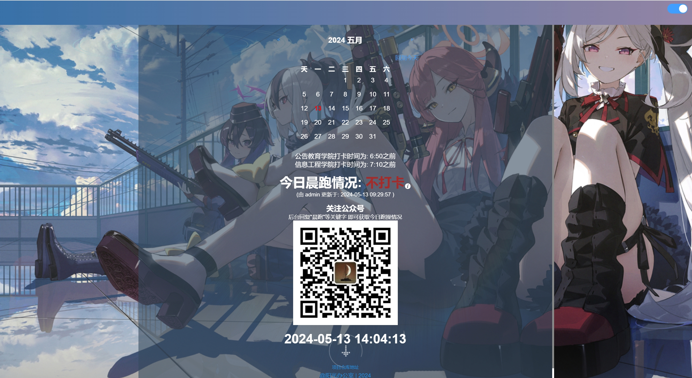
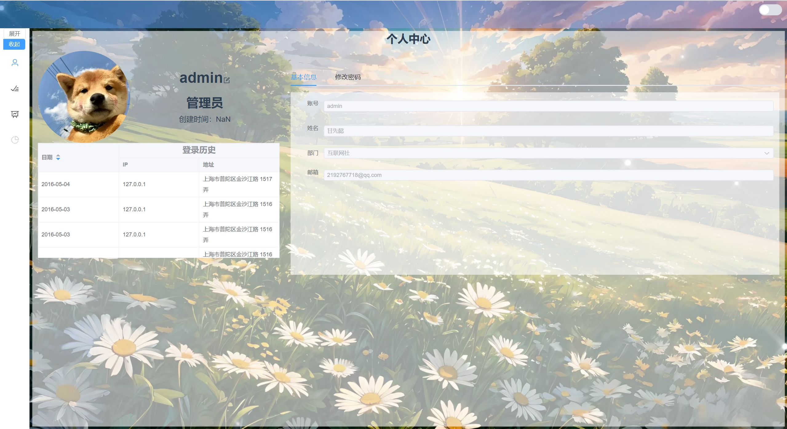
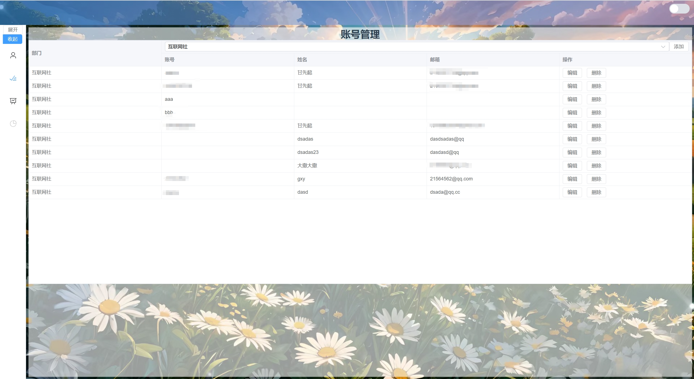
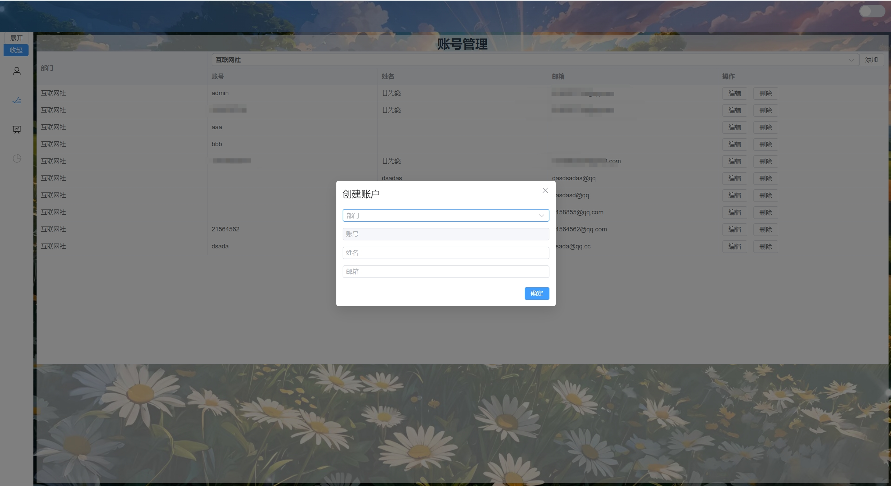
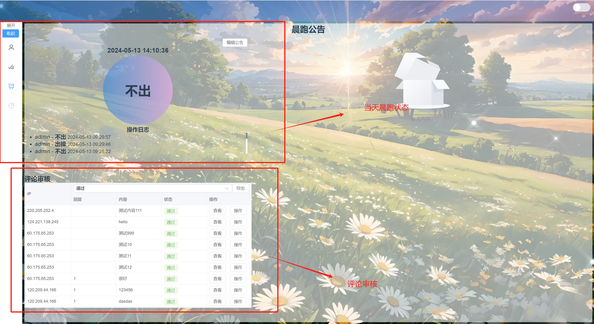
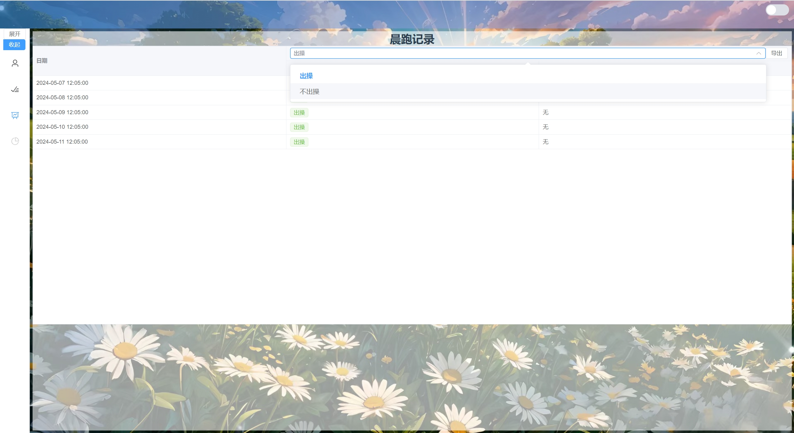

# 晨跑公告系统

## 项目版本信息
+ Vue 3.2.13
+ Springboot 2.7.16
+ Java 17

## 前端项目初始化
```
npm install
```

### 本地编译与热加载
```
npm run dev
```

### 打包
```
npm run build
```

### 更多配置
详见 [Configuration Reference](https://cli.vuejs.org/config/).

在部署静态文件作PHP站点的配置文件

```伪静态
location / {
  if (!-e $request_filename) {
    rewrite  ^(.*)$ /index.html?s=/$1  last;
    break;
  }
}

```

```nginx.conf
需要加一段

location /api/ {
    rewrite  ^.+api/?(.*)$ /$1 break;
    proxy_pass http://124.221.138.245:40501;
}

```


## 后端项目初始化

1. 配置数据库
+ 导入数据库文件 database.sql
+ 搭建Redis数据库 配置文件 Springboot\src\main\java\cn\ganxy03\run\config\RedisUtil.java
2. 配置文件
+ 后端配置信息 Springboot\src\main\resources\application.yml
+ 拦截器配置信息 Springboot\src\main\java\cn\ganxy03\run\inteceptor\VerifyCodeInterceptor.java
3. 启动项目
推荐使用IDEA构建Maven启动项目

## 使用手册

### 首页

### 评论页
此处做了评论审核  
评论展示需要后台审核通过后才能展示


### 管理
#### 个人中心
可以查看个人信息  
以及修改密码


#### 账号管理
简单实现了创建和修改

 

#### 晨跑状态及评论管理


#### 晨跑记录
简单实现了查看晨跑记录
 
